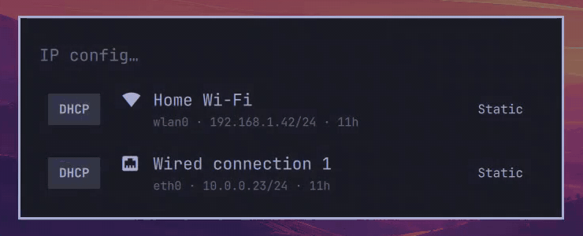

# IP config for Omarchy

A small [Omarchy](https://omarchy.org) shell plugin for flipping network adapters between DHCP and a static IP. It also turns adapters off and on. It looks and behaves like the Omarchy menu, and every action works from the keyboard or with the mouse.



## Features

- **One row per adapter** (Wi-Fi and Ethernet), showing its current IP address, or its state if it has none (Off, No cable, Connecting…).
- **DHCP and Static buttons** on each row. The active mode is highlighted.
- **Static IP in one line:** `10.0.0.50/24 10.0.0.1 1.1.1.1`. A missing mask means `/24`, and if you leave out DNS the gateway is used. Typing `dhcp` switches back.
- **Remembers your old static IP.** Switching to DHCP saves the static settings on the NetworkManager profile, whether this plugin or another tool set them. Opening Static later fills them back in.
- **Adapters work independently.** While one adapter waits on DHCP, you can still use the others.

## Requirements

- Omarchy with the Quickshell-based `omarchy-shell`
- NetworkManager (`nmcli`)
- `python-gobject` with libnm's GObject bindings, used to save static settings on the profile
- `notify-send`, for error notifications

## Install

```sh
omarchy plugin add https://github.com/fivefold3/omarchy-ip-config --enable
```

Then bind a key in `~/.config/hypr/bindings.lua`:

```lua
o.bind("SUPER + N", "IP config", "omarchy-shell shell toggle ip-config")
```

If `SUPER + N` is already taken on your setup, call `hl.unbind("SUPER + N")` first, or pick another key.

## Keys

| Key | List | Static IP prompt |
|---|---|---|
| `Enter` / `Space` / click | Turn the adapter off or on | Apply |
| `→` / Static button | Open the static IP prompt | Move the cursor |
| `←` / DHCP button | Switch to DHCP | Move the cursor. Pressed at the start, goes back |
| `↑` `↓` / `j` `k` | Move between adapters | |
| `Esc` | Close | Back to the list |

**Turning an adapter off:** for Wi-Fi this switches the radio off, the same as the Wi-Fi toggle in the bar. For Ethernet it disconnects the device through NetworkManager, and it stays down until you turn it back on. That doesn't need root, unlike taking the link down.

## How it works

- `IpConfig.qml` is the UI.
- `ip-config` is a Bash script that does all the NetworkManager work. It runs on its own too:

```sh
ip-config list                      # TSV: device type enabled connection method address state
ip-config toggle eth0
ip-config static eth0 "10.0.0.50/24 10.0.0.1 1.1.1.1"
ip-config dhcp eth0
ip-config prefill eth0              # what the static prompt would be filled with
```

`nmcli` can't write to a profile's user data, so saved static settings go through libnm. They're stored under the `ip-config.static-ipv4` key.

## Re-recording the demo

`demo/mock-backend` has the same interface as `ip-config`, but it keeps fake adapters in a scratch file, so recording never touches real networking. `demo/record.sh` drives the plugin on an empty workspace with `wtype` and records it with `gpu-screen-recorder`. `demo/make-gif.sh` crops the recording and converts it:

```sh
demo/record.sh /tmp/demo.mp4
demo/make-gif.sh /tmp/demo.mp4
```

## License

MIT
